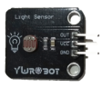
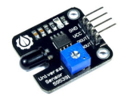

# 模拟量输出类传感器

## 3.1简介

模拟量输出类传感器是以连续的电压信号作为输出的一类传感器，此类传感器输出的电压信号一般为 0-VCC，其输出引脚连接到主控板的模拟输入端口，主控板的模拟输入端口通过主控制器内部的 ADC（模/数转换器）将传感器输入的电压信号转换为数值，由于主控制器的 ADC 转换精度不同，实际转换后的数字信号范围也不同，甜橙 2.0 主控制器的 ADC转换后的数字信号范围为 0～1023。 在连接硬件时需要注意传感器引脚与主控板端口一一对应，尤其注意正（VCC）负（GND）极引脚不能反接，否则会烧坏主控板或者传感器。

模拟量输出类传感器主要有以下几种：

| 实物图片 | 传感器名称 | 简介 |
| :--- | :--- | :--- |
|  | 旋钮开关 | 旋钮开关的 OUT 端口可输出 0-VCC 的模拟量电压信号，转动旋钮端子可改变输出电压信号的大小。 |
|  | 摇杆模块 | 该遥杆模块有 3 路输出端口，其中两路为 x 轴和 y 轴的模拟量电压信号输出端口，一路为按键的数字电平信号输出端口。遥杆模块的 x/y 轴由电位器组成，在没有外力作用时，遥杆会自动回中，当遥杆转到不同位置时，x/y 轴对应输出信号的大小也不同，主控板通过模拟输入端口读取遥杆模块 x/y 输出端口的值，便可知道遥杆当前位置。 |
|  | 光敏传感器 | 光敏传感器可以将光信号转换成电信号并且以模拟量输出，其感光元件为光敏电阻，当光照增强时，光敏电阻的阻值减小，流过电阻上的电流增加，导致输出的电信号数值增加。使用时需要将感光元件外露。 |
|  | 声音传感器 | 声音传感器可检测周围声音强弱变化，转换成电信号输出，但不能记录声音内容和识别指定声音。该传感器内置放大电路，通过自带的电位器可调节传感器灵敏度。 |
|  | 火焰传感器 | 该款火焰传感器的探头为红外接收二极管，对火焰光谱特别灵敏，可用来探测火源或者其他一些波长在 760-1100nm 范围内的热源，该传感器有两个信号输出端口 DOUT和 AOUT，其中 DOUT 输出数字电平信号，调节模块上的电位器设置一个阀值，超过阀值则输出低电平，否则输出高电平；AOUT 输出模拟量电压信号，可以检测当前的火焰强度。 |
|  | 烟雾报警传感器 | 该传感器对天然气、液化石油气等烟雾有很高的灵敏度，尤其对烷类烟雾更为敏感，当烟雾浓度增大时，传感器输出的模拟信号就会增大。该传感器有两个信号输出端口DOUT 和 AOUT，其中 DOUT 输出数字电平信号，AOUT 输出模拟量电压信号，传感器在使用之前需要预热一段时间，否则其输出的检测信号不准确。 |
|  | 土壤湿度传感器 | 该传感器是一个简易的水分传感器，将其插入土中，通过检测电阻值的变化来测量土壤中的水分，土壤越干燥，传感器的输出电压越小，土壤越湿润传感器输出的电压越大，在该传感器的供电电压为 5V 时，其输出电压约 0-3.6V（3.6V 为完全浸入水中的电压），因水质不同，实际输出电压会有偏差。此传感器为消耗品，寿命约 6-12 个月。 |
|  | 水位传感器 | 该传感器是一款利用电阻值变化测量液位高度的简易液位传感器，使用时可将该传感器固定在被检测的水面上，当液位增高时，传感器与水面接触面积增大，其输出电压增大，反之，其输出电压减少。传感器有刻度标注，方便标定水位。此传感器为消耗品，会受到液体氧化腐蚀。 |

