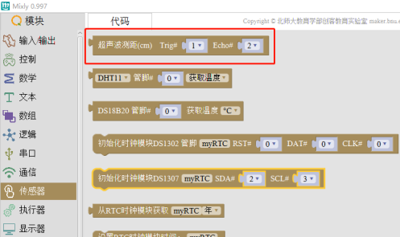
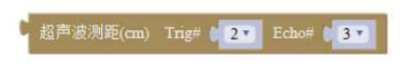

# 超声波传感器

## 4.3.1 简介

超声波传感器是将超声波信号转换成电信号的传感器，该传感器有两个超声波探头，一个用于发送超声波，一个用于接收返回的超声波。在应用中，超声波传感器先发出 8 个 40kHz 周期电平并检测回波，通过发射信号到收到回响信号的时间间隔可以计算得到距离，计算公式为：距离=高电平时间×声速（340M/S）÷2。该款超声波的检测距离为 2～450cm，精度为 0.3cm，2cm 以内为盲区，检测不出实际的距离。

## 4.3.2 超声波传感器在 Mixly 中使用示例

（1）打开 Mixly，在左侧模块栏中选择 传感器→超声波测距，如图 4.3-1 所示，本示例中将超声波传感器的 Trig 和Echo 连接到主控板的 D2 和 D3 端口，由此更改“超声波测距”模块 Trig 和 Echo 的管脚号为 2 和 3，如图 4.3-2 所示。

（2）参照以下程序连接程序模块，如图 4.3-3 所示，其中串口波特率、串口打印模块可在 Mixly 左侧模块栏的串口选项中选择，文本模块可在文本选项中选择。

（3）将超声波传感器与主控板连接好，上传程序到主控板，示例中将超声波传感器朝向地面，打开 Mixly 的串口监视器，在串口监视器中可观察到超声波传感器距离地面的高度，如图 4.3-4 所示：

（4）在 Mixly 示例程序文件中打开“超声波传感器测距示例”，按照上述示例连接完硬件后，上传程序到主控板，打开Mixly 的串口监视器可观察到超声波传感器检测到的距离数据。

## 4.3.3 超声波传感器应用场景举例

超声波传感器常应用于距离检测，或者以距离为判断条件触发其他功能的场景中。

例：距离检测器，身高测量仪，超声波避障小车，超声波跟随小车。

