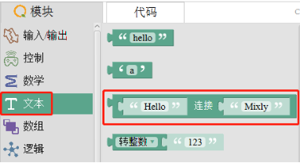
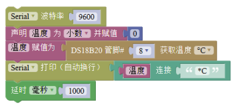
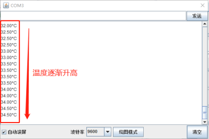

# 温度传感器

## 4.1.1简介

DS18B20 是一款数字温度传感器，可定量检测环境温度，其测温范围为﹣55℃～﹢125℃，固有测温分辨率为 0.5℃。该传感器采用数字双向单总线的方式（一条数据线）与主控板传输数据，抗干扰性强，适用于恶劣环境下的现场测温。当环境温度突然上升或下降时，温度传感器的传感部分也会随之逐步改变，不会立刻上升或下降到当前环境的温度。 DS18B20 温度传感器的三个引脚分别为 GND、VCC、DAT，其中 DAT 为数据传输引脚，在硬件连接时需连接到主控板的 D（A）端口，下述示例中温度传感器的 DAT 引脚连接到主控板的 D8 端口，另外 GND 和 VCC 引脚需连接到主控板的 G 和 V 端口。

## 4.1.2温度传感器在 Mixly 中使用示例

本案例通过串口监视器显示温度值和温控 LED 灯两个示例说明温度传感器 DS18B20 的使用方法。

（1）打开 Mixly，在左侧模块栏选择 变量 →声明模块，如图 4.1-1 所示，修改变量名称（item）为“温度”并根据传感器输出的数据类型选择变量的数据类型为小数，如图 4.1-2 所示。

（2）在左侧模块栏中选择 数学 →0 ，如图 4.1-3 所示，并将其连接到上述模块，用于初始化变量为 0。注：如果不连接此模块，则变量初始化也默认值为 0。

（3）在左侧模块栏中选择 传感器 →DS18B20 ，如图 4.1-4 所示，示例中温度传感器连接到主控板的 D8 端口，因此在程序中需要更改管脚号为 8。在左侧模块栏选择 变量 →温度赋值为，将 DS18B20 获取的温度赋给“温度”变量，如图4.1-5 所示。 

（4）在左侧模块栏中分别选择 串口 →Serial 波特率以及 Serial 打印（自动换行），如图 4.1-6 所示。使用串口打印功能，可以通过串口监视器观察到传感器采集到的温度数据。

（5）在左侧模块栏中选择 文本 →连接，如图 4.1-7 所示，在模块栏中选择 变量 →温度，并将其拼接到“连接”模块的第一个空格，修改“连接”模块的第二个空格为“\*C”，如图 4.1-8 所示。 

（6）在模块栏中选择 控制 → 延时，如图 4.1-9 所示。使用延时模块方便在串口监视器观察温度传感器采集到的温度数据。

（7）将以上步骤中已选择的模块按下图连接好，如图 4.1-10。

（8）将程序上传到主控板，打开 Mixly 的串口监视器，可以看到当前环境的温度，将温度传感器的传感部分靠近装热水的水杯或者将其放在手心，可以观察到串口监视器打印的温度值逐步增加，如图 4.1-11 所示。 

（9）除上述示例外，还可以通过判断读取的温度数值大小控制 LED 灯的亮灭（温控 LED 灯），程序如图 4.1-12 所示，示例中的 LED 灯连接到主控板的 D11 端口。上传程序到主控板，将温度传感器的传感部分靠近装热水的水杯或者将其放在手心，使其温度增加，当温度超过 36℃（数值可改变）时，LED 灯亮，否则 LED 灯灭。 

（10）在 Mixly 示例程序文件中打开“温度传感器 DS18B20 示例”，将此示例上传到主控板后，可从串口监视器中观察到温度传感器返回的数据，改变环境温度，可观察到串口打印的温度值随之改变。

## 4.1.3温度传感器应用场景举例

温度传感器可以应用在对环境温度进行测量，或以温度作为判断条件触发其他功能的场景中。

例如：温度检测器，温度报警器，温控 LED 灯。

