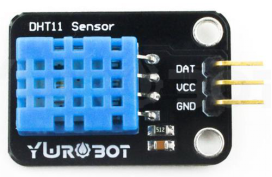
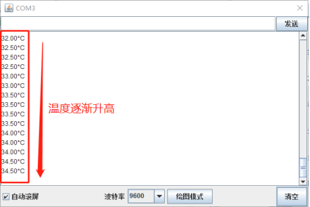
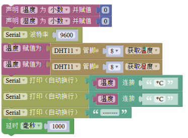
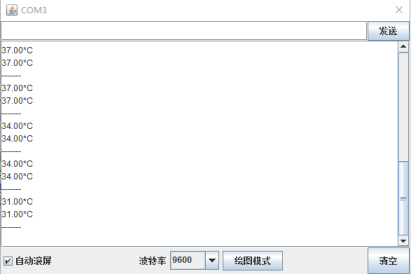

# 温湿度传感器

## 4.2.1 简介

DHT11 温湿度传感器是一款含有已校准数字信号输出的温湿度复合传感器，可以感知周围环境的温度和湿度变化，具有极高的可靠性与长期稳定性。其测温范围为 0～50℃（±2℃），测湿范围为 20～90%RH（±5%RH）。DHT11 反馈数据会随着环境温湿度变化逐步改变，直到稳定检测到当前环境的温湿度。测试时避免液体进入传感器。

## 4.2.2 温湿度传感器在 Mixly 中使用示例

案例中以 Mixly 的串口监视器显示温湿度传感器采集的温度和湿度为例说明温湿度传感器在 Mixly 中的应用。

（1）打开 Mixly,在左侧模块栏选择 传感器 →DHT11，如图 4.2-1 所示，示例中温湿度传感器数据输出引脚连接到主控板的 D8 端口，因此在程序中将管脚号改为 8，如图 4.2-2。

（2）在模块栏中分别选择 串口 →Serial 波特率以及 Serial 打印（自动换行），如图 4.2-3 所示。

（3）从模块栏中分别选择声明变量、文本框和延时模块，按照图 4.2-4 所示连接。其中，变量的声明与使用、延时模和文本框的选择与修改方法均可参照本章节温度传感器在 Mixly 中使用示例的步骤。 

（4）上传程序到主控板，打开串口监视器，当改变环境温度时（可将温湿度传感器放到手心或者靠近装热水的水杯），可以从串口监视器中观察到温度逐步上升，如图 4.2-5 所示。

（5）当需要同时读取温度和湿度值时，可以参考如图 4.2-6 所示的程序，变量的声明和使用以及文本框的调用可参照本章节温度传感器在 Mixly 中使用示例的步骤。当环境温湿度改变时，可通过串口监视器观察到 DHT11 返回的温湿度变化，如图 4.2-7 所示。

（6）在 Mixly 示例程序文件中打开“温湿度传感器 DHT11”示例文件，将此示例上传到主控板后，可从串口监视器中观察到温湿度传感器返回的数据，改变环境温湿度，可观察到串口打印的温湿度数据也逐渐随之改变。

## 4.2.3 温湿度传感器应用场景举例

温湿度传感器可以应用在对环境温湿度进行测量，或以温湿度作为判断条件触发其他功能的场景中。

例如：温湿度检测仪、温湿度报警器、智能加湿器。

