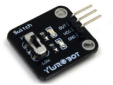
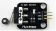
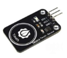
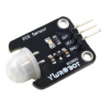
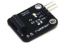

# 数字开关类传感器

## 2.1 简介

数字开关类传感器是以高低电平为输出信号的一类传感器，此类传感器向主控制器输出信号“1”代表高电平，输出信号“0”代表低电平，而且只有这两种状态，因此，这类传感器只可以连接到主控制器的数字输入端口。

数字开关类传感器模块一般有三个引脚，分别为 GND、VCC、OUT（SIG），这三个引脚分别连接到主控板的 G、V、D\(A\)端口，连接硬件时需要注意传感器引脚与主控板端口一 一对应。

注：

1、 数字开关类传感器的输出信号以实际使用为准。

2、 大部分数字开关类传感器的引脚与上述相同，但也有例外，在实际使用时需要特别注意。

数字开关类传感器主要有以下几种：

| 实物图片 | 传感器名称 | 简介 | 输出信号 |
| :--- | :--- | :--- | :--- |
|  | 大按键开关 | 按压式数字开关，工作电压为 3.5V 或 5V | 按下：输出低电平 抬起：输出高电平 |
|  | 拨动电平开关 | 拨动开关的两侧有 HIGH 和 LOW 标记，将开关拨动到任一侧可改变输出电平 | 拨动到 HIGH 侧：输出高电平； 拨动到 LOW 侧：输出低电平 |
|  | 碰撞开关 | 可检测物体是否发生了碰撞。该模块分为左碰撞开关和右碰撞开关（仅开关方向变化，原理和使用方 法无区别）。 | 按下滚轮：输出低电平 释放滚轮：输出高电平 |
|  | 触摸开关 | 有自锁和非自锁两种，灵敏度高，可以隔着纸张等非导电材料触摸检测，触摸开关在上电后 0.5 秒会自动校准，故建议上电时不要手持传感器部分。 | 非自锁触摸开关： 按下：输出低电平 释放：输出高电平 自锁型触摸开关： 按下后释放：开关切换电平并保持 |
|  | 倾斜传感器 | 倾斜传感器内部的滚珠随倾斜角度不同而触发电路输出电平信号，可用于倾斜、倾倒、晃动的检测 | 倾斜：输出高电平 未倾斜：输出低电平 |
|  | 红外反射传感器 | 采用红外非调制反射检测方式，可识别黑白线，使用过程中注意避开强光照射，可用于智能小车的循迹检测 | 检测白线：输出高电平 检测黑线：输出低电平 |
|  | 人体红外传感器 | 采用专用的红外检测头，可检测到运动的人或动物身上发出的红外线，感应距离 6m 左右，感应角度 100°，信号输出有 3 秒左右的延时，使用时需要将白色部分外露 | 有感应：输出高电平 无感应：输出低电平 |
|  | 振动传感器 | 可以感知到自身的振动。其内部分为两极：一极为固定着金属球的弹簧，另一极为包裹弹簧和金属球 的部分。当外部震动使得弹簧振动达到一定幅度后，传感器的两极就会接通，从而输出振动信号 | 有振动：输出低电平 无振动：输出高电平 |
|  | 磁力传感器 | 用于检测传感器周围是否有磁铁 | 有磁铁：输出低电平 无磁铁：输出高电平 |
|  | 红外接近开关 | 可用于检测距离，范围10-30cm，检测不同材料的物体时，其检测距离也会有所不同 | 检测到物体：输出低电平 未检测到物体：输出高电平 |

