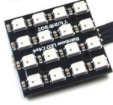
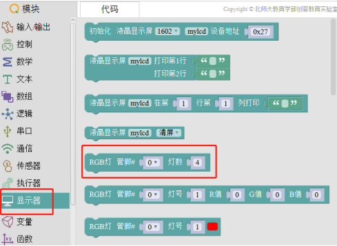

# WS2812 全彩 LED 灯

## 6.2.1 简介

WS2812 全彩 LED 灯的灯芯是由红、绿、蓝三色灯组成，内置控制芯片，只需要一个引脚就可以控制 LED 灯显示各种颜色。WS2812 全彩 LED 灯模块的两端均有引脚，一端为 IN，一端为 OUT，多个全彩 LED 模块可以通过 IN 和 OUT引脚相互串接。主板发出的颜色信号只能从 IN 一侧进入全彩 LED 灯，并可以从 OUT 一侧传递给下一个全彩 LED 灯。

本说明书中主要介绍 4\*4 点阵型 WS2812 全彩 LED 模块，该模块的全彩 LED 灯之间已串接在一起，通过编程可控制模块中单个或多个 LED 的颜色和亮度。

## 6.2.2 WS2812 全彩 LED 灯在 Mixly 中使用示例

（1）打开 Mixly，在左侧模块栏选择 显示器 →RGB 灯-管脚-灯数，如图 5.2-1 所示，示例中 WS2812 全彩 LED 灯模块接到主控板的 D10 端口，在程序中将管脚号改为 10，灯数根据串接全彩 LED 灯的数量来设置，示例中设置为 16，程序如图 6.2-2 所示。 

（2）在 Mixly 左侧模块栏选择 显示器 →RGB 灯-管脚-灯号-R 值-G 值-B 值，如图 6.2-3 所示，管脚号的设置与上述步骤一致，灯号按照实际需要进行设置，示例中设置为 1，R、G、B 设置 数值范围为 0～255，数值越大全彩 LED 灯的亮度越大，示例如图 6.2-4 所示。 

（3）设置全彩 LED 灯颜色的程序除步骤 2 以外，还有另一种方法，在 Mixly 左侧模块栏的显示器选项中选择带有选色器的程序模块，管脚号设置与上述步骤一致，颜色的选择可打开选色器，如图 6.2-5 所示，选择好颜色之后，程序如图 6.2-6 所示。

注：

1.设置颜色的两种方法可以分别使用，也可以一起使用，本示例中将两个程序放在一起使用，分别设置 1 和 2 两个全彩 LED 灯的颜色。

2.使用选色器设置全彩 LED 灯的颜色时，全彩 LED 灯实际显示的颜色与选色器的颜色会有差别。

（4）按照图 5.2-7 所示连接程序，将全彩 LED 灯模块连接到主控板，上传程序，可观察到全彩 LED 灯模块的第一个和第二个 LED 灯亮，并且颜色与程序设置的一致。

注：LED 的强光对眼睛有害，请不要直视。

（5）在 Mixly 示例程序文件中打开“彩灯控制示例”，上传程序到主控板，可观察到与上述示例相同的现象。

## 6.2.3 WS2812 全彩 LED 灯应用场景举例

WS2812 全彩 LED 灯可以通过程序控制显示不同的颜色，可应用于需要不同颜色或者色彩变化的场景中。 例如：装饰彩灯、调色器。

