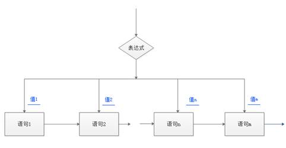

# 多分支结构

功能描述：

如果表达式的值为真，则执行语句1，然后退出if选择语句不执行下面的语句；否则，判断表达式2，如果表达式2的结果为真，则执行语句2，然后退出if选择语句，不执行下面的语句，同样，如果表达式的值为假则判断表达式3，以此类推，最后如果表达式n不成立，则执行else后面的语句。

注：一个判断框有两个出口，而分支结构只有一个出口，切记不要混为一谈。

如右图4-7所示，为多分支结构，假设管脚2、3、A4、A5均与按钮开关相连，管脚8/9/10、11均与单色LED灯相连，那么此程序执行顺序为：如果2号管脚相连的按钮按下，8号管脚相连的LED灯点亮；如果3号管脚相连的按钮按下，那么与9号管脚相连的LED灯点亮；如果A4号管脚相连的按钮按下，那么与10号管脚相连的LED灯点亮；如果A5号管脚相连的按钮按下，那么与11号管脚相连的LED灯点亮；如果没有按钮按下，那么所有的LED灯都熄灭。

