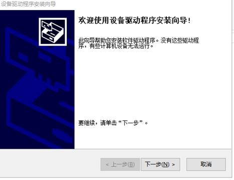
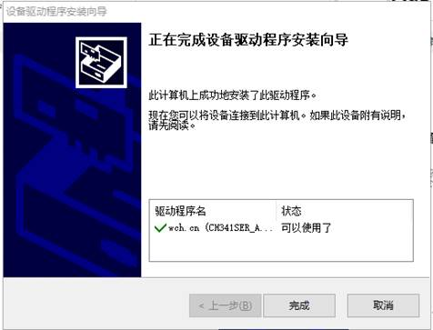
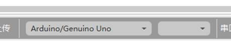

# 安装驱动

安装驱动前，需要知道待安装的电脑是32位的，还是64位的操作系统，可打开电脑“设置”，查看“系统”选项中的“关于”，如图1.2-1，可看到该电脑是64位的操作系统；

或者打开“我的电脑”，点击右上角“属性”按钮，如图1.2-2会看到如图1.2-3所示查看；或者直接在桌面右键“我的电脑”--选择“属性”按钮，也可以看到图1.2-3所示界面。

安装端口驱动时，如图1.2-4，如果是64位的，就选择64位的安装包；然后点击打开，会弹出如图1.2-5所示窗口，点击下一步，会弹出如图1.2-6所示窗口，点击完成；此时端口驱动程序安装完成。

安装完这两项，我们的环境搭建就完成了，硬件接上电脑后可以被识别使用了。

Q：端口驱动损坏，有如下表现;

a、电脑不识别硬件设备，如图1.2-7，这时电脑的端口驱动工作异常，可以换接口、换硬件、重装驱动，若重装驱动后还是这样不识别，是电脑的配置有问题，且C盘可用空间太小，请等待电脑反应。

b、不知道安装哪个驱动，这需要知道待安装的电脑是多少位的操作系统，。

c、软件不识别端口如图1.2-8所示，需要检查 COM 口工作状态 是否正常。

选中电脑桌面的计算机图标，点击鼠标右键，在弹出列表中选择“管理”，在弹出的计算机管理窗口左侧栏中选择“设备管理器“，在窗口右侧栏打开“端口”列表，查看主控板对应的 COM 口，如图 1.2-9，图示 COM 口显示正常。

注： 如果不显示 COM 口或者 COM 口有黄色叹号则表示驱动未安装，需要安装驱动。

A：重新安装驱动。

