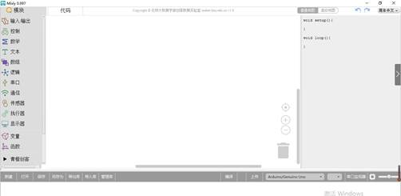
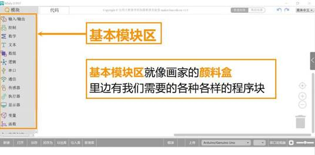
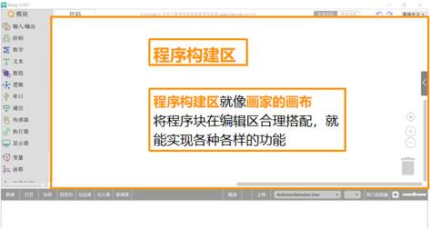
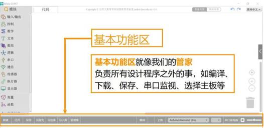

# 认识Mixly

Mixly分为6个区域，分别是基本模块区、青橙模块区、程序构建区、基本功能区、显示信息区、源代码显示区域（平时缩在右边界，点击箭头会显示出来）。

1、Mixly在正常情况下，只能使用图形化编成区域来编写程序，源代码显示区域是没法修改的。当然，你可以点击图形化编程区域上端的“代码”进入到代码编写模式如图1.3-1所示。

在代码编写模式下，你可以修改和编写代码，不过这里编写好代码后，图形化编程区域根本不会显示，所以除非你全部想使用代码来编写，不然还是建议不要直接修改代码。

2、Mixly在正常情况下，只能使用图形化编成区域来编写程序，源代码显示区域是没法修改的。当然，你可以点击图形化编程区域上端的“代码”进入到代码编写模式如图1.2-2所示。

3、在代码编写模式下，你可以修改和编写代码，不过这里编写好代码后，图形化编程区域根本不会显示，所以除非你全部想使用代码来编写，不然还是建议不要直接修改代码。Mixly的软件的五部分，分别为基本模块区、青橙模块区、程序构建区、基本功能区、显示信息区如图1.2-3所示。

4、基本模块区就像画家的颜料盒，里面有我们需要的各种各样的程序块，包括输入输出、控制、数学、文本、数组、逻辑、串口、通信、传感器、执行器、显示器、变量、函数等。

5、程序构建区就像画家的画布，将程序块在编辑区合理搭配，就能实现各种各样的功能。我们从模块区拖出的程序块就在这里被编辑、搭配，以实现各种各样的功能。

6、垃圾桶，将编辑区的程序块拖入垃圾桶就可以删除了，同时，将程序块拖到基本模块区和青橙模块区也可以删除掉了。

7、基本功能区，就像我们的管家，负责所有设计程序之外的事，如新建、打开、另存为、导出库、导入库、管理库、编译、上传、保存、串口监视、选择主板、选择串口等。

