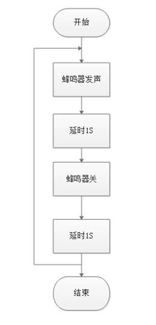
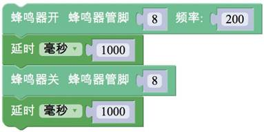

# 任务1——让蜂鸣器发声

## 1、任务目标

通过编写程序控制蜂鸣器播放指定音乐。

## 2、流程图

## 3、程序编程

注意：播放完声音后加上蜂鸣器关的程序。

## 4、硬件连接

硬件连接： 蜂鸣器——8。注意插线时的颜色对应。

## 5、Q&A

Q：为什么关闭蜂鸣器后需要加上“延时”程序块？

A：整个程序是循环执行的，如果不加延时，会造成，音乐几乎不停顿播放。

## 6、拓展

1、知识点总结

1）顺序结构

2）“蜂鸣器开”与“蜂鸣器关”的配合使用；

2、相关案例

1）本项目任务2；

2）项目八的任务1；

