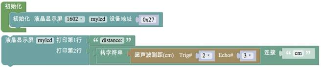
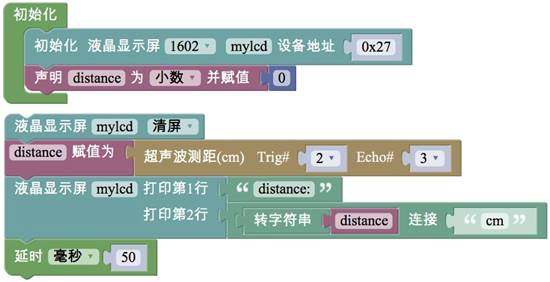
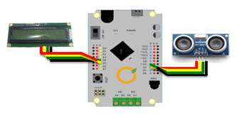

# 任务1——超声波模块测量距离

## 1、任务目标

将超声波传感器检测到的距离显示在LCD1602液晶显示屏上。

## 2、流程图

## 3、程序编程

请你观察上面的程序是否能正确输出?如果不能，想一想应如何修改。

## 4、硬件连接

硬件连接：超声波——表1；液晶显示模块——表2。注意插线时的颜色对应。

表1

| 超声波 | 甜橙板 |
| :--- | :--- |
| VCC | 5V |
| Trig | 数字口2 |
| Echo | 数字口3 |
| GND | 地 |

表2

| LCD1602显示屏 | 甜橙板 |
| :--- | :--- |
| SDA | 模拟口A4 |
| SCL | 模拟口A5 |
| VCC | 5V |
| GND | GND |

## 5、Q&A

Q：显示屏上没有示数或者示数不变？

A：没有将超声波测量的值赋给变量，首先需要声明变量，赋值变量在初始化程序块外面。

## 6、拓展

1、知识点总结

1）“初始化”程序块中的程序仅执行一次；

2）LCD1602液晶显示屏的“清屏”程序块；

3）LCD1602液晶显示屏的打印；

4）变量的使用；

2、相关案例

1）项目十一的任务1；

