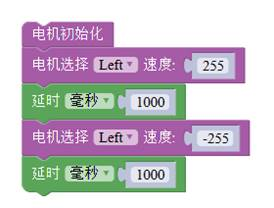

# 任务1——实现电机的正反转

## 1、任务目标

通过外接电源供电，程序控制实现HR8833减速电机正转和反转。

## 2、流程图

## 3、程序编程

程序模块中的 left 和right 分别对应主控板上的 M1 和 M2 两个接线端子连接的电机，速度范围为-255-255，负值越小为电机反转速度越快，正值越大为电机正转速度越快，速度 0 为电机停止。

## 4、硬件连接

硬件连接：红色线---D4；黑色线---D5。

外接电源：DC接口连接外接的9V电源，并将甜橙板的电源从“off”拨到“on”。

## 5、Q&A

Q：程序上传成功后，电机并没有开始转动；

A：检查外接电源的开关是否拨到“ON”,甜橙板外接电源处是否拨到“ON”端。

## 6、拓展

1、知识点总结

1）HR8833的接线；

2）“电机初始化”程序块；

3）left电机对应M1的接口，Right电机对应M2两个接口；

4）外接电源供电；

2、相关案例

电机需要**外接电源**供电，用六节5号电池，DC接口；在程序上传成功后，外接电源盒，打开电池盒和甜橙版的电源开关，电机开始转动。

