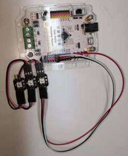

# 任务1——WS2812 全彩 LED 灯

## 1、任务目标

将三个全彩LED灯颜色设置依次是红黄绿。

## 2、流程图

## 3、程序编程

## 4、硬件连接

硬件连接：IN端控制灯颜色，OUT端连接下一个全彩LED灯；D3连接1号彩灯的IN控制端。

注：观察单个全彩灯模块，有电容的一角为IN，也可以看灯壳，缺角的一侧为IN端，另一端为OUT。

## 5、Q&A

Q：程序上传成功后，灯不亮？

A：查看甜橙版是否连接的是全彩灯的IN端，第二个全彩灯的IN端。

## 6、拓展

1、知识点总结

1）全彩灯的接线，控制端为IN，OUT端与下一个全彩灯的IN连接；

2）全彩灯的控制，灯号没有重复；

3）全彩灯阵的控制，可以通过单个的全彩灯来控制；

全彩灯阵的控制，IN端在左端时，左上角第一个灯为1号灯，其右方为2号灯，第二行第一个为5号灯。

2、相关案例

