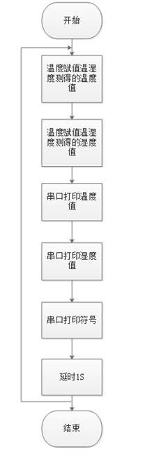
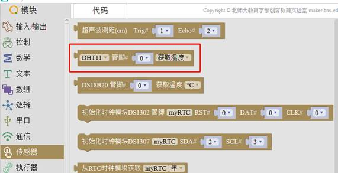
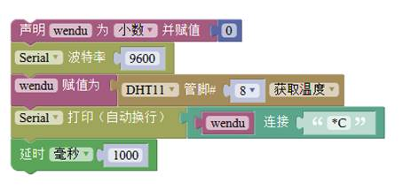
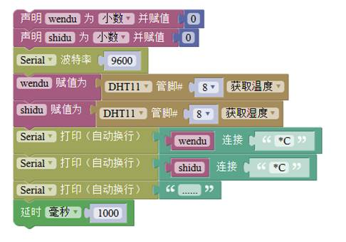

# 任务1——制作一个温度仪

## 1、任务目标

在串口打印出温湿度传感器测出的温度值和湿度值。

## 2、流程图

## 3、程序编程

1）打开 Mixly,在左侧模块栏选择 传感器 →DHT11，如图 3.15-2 所示，示例中温湿度传感器数据输出引脚连接到主控板的 D8 端口，因此在程序中将管脚号改为 8，如图 3.15-3。

2）在模块栏中分别选择 串口 →Serial 波特率以及 Serial 打印（自动换行），如图 3.15-4 所示。

3）从模块栏中分别选择声明变量、文本框和延时模块，按照图 3.15-5所示连接。

4）上传程序到主控板，打开串口监视器，当改变环境温度时（可将温湿度传感器放到手心或者靠近装热水的水杯），可以从串口监视器中观察到温度逐步上升，如图 3.15-6 所示。

5）当需要同时读取温度和湿度值时，可以参考如图 3.15-7 所示的程序，变量的声明和使用以及文本框的调用可参照本章节温度传感器在Mixly 中使用示例的步骤。当环境温湿度改变时，可通过串口监视器观察到 DHT11 返回的温湿度变化，如图 3.15-8 所示。

6）在 Mixly 示例程序文件中打开“温湿度传感器 DHT11”示例文件，将此示例上传到主控板后，可从串口监视器中观察到温湿度传感器返回的数据，改变环境温湿度，可观察到串口打印的温湿度数据也逐渐随之改变。

## 4、硬件连接

硬件连接：DH11---8。

## 5、Q&A

Q：靠近热源后，串口打印的温度值没有变化？

A：最好声明一个变量，用来存储检测到的温度值。

## 6、拓展

1、知识点总结

1）“DHT11温湿度传感器”程序块的使用；

2）温湿度传感器的接线；

3）变量的使用，先声明，在赋值使用；

2、相关案例

温湿度传感器DHT11与温度传感器DS18B20的使用方法的异同。

