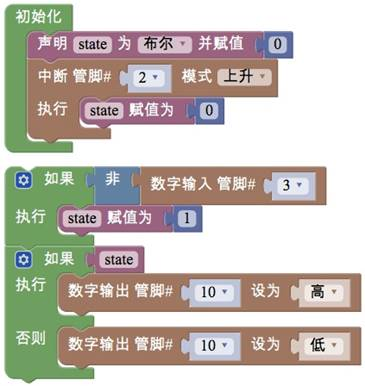
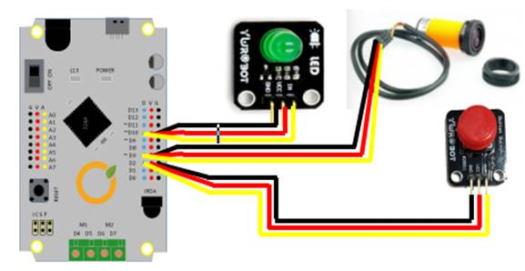

# 任务2——记录入侵

## 1、任务目标

红外接近开关控制点亮灯，按钮控制熄灭灯。当障碍物走进红外开关的检测范围时，灯被点亮，通过按下按钮熄灭灯。

## 2、流程图

## 3、程序编程

## 4、硬件连接

硬件连接：红外入侵检测仪——3；LED ——10；按钮——2。注意红外接近开关的插线：棕对红，蓝对黑，黑对黄。

## 5、Q&A

Q：红外开关检测到物体后，灯没有点亮？

A：检查线色的对应情况，按下复位按钮，重新检测；

Q：按下按钮开关后，灯没有熄灭？

A：将中断程序块放在初始化模块中，检查STATE的变量类型。

## 6、拓展

1、知识点总结

1）红外开关的原理；

2）按钮开关；

3）布尔变量的转换机制；

2、相关案例

1）项目四的任务1；

