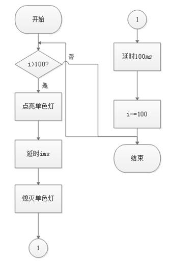
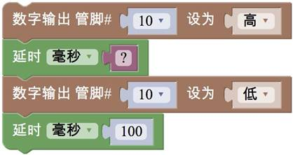
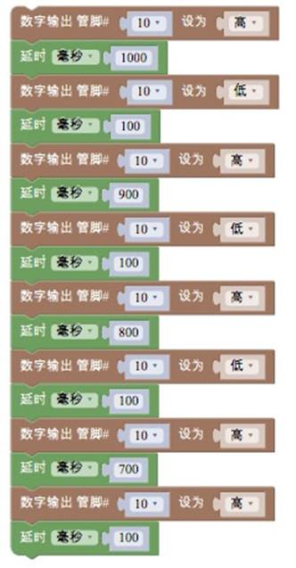
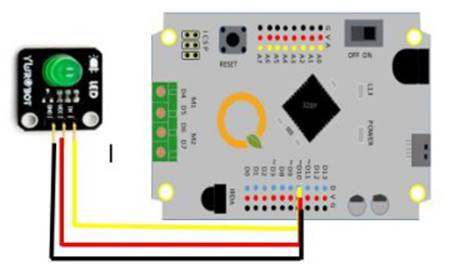

# 任务2——让LED越闪越快

## 1、任务目标

通过编写程序控制一盏单色LED灯使其越闪越快，第一次点亮后灯保持1S然后熄灭100ms，第二次点亮后保持900ms,然后熄灭，以此类推，第十次点亮100ms，熄灭100ms，然后开始点亮1S后熄灭，重复执行。

## 2、流程图

循环的次数通过变量 i 的大小来控制。所谓变量，就是在程序运行过程中大小发生变化的 量。循环执行过程中，变量 i 从 1000 开始，每次减小100，直到减小到 100，然后循环 结束。每次循环，都会执行一次包在其中的程序\(这里就是控制灯亮灭的程序\)。

## 3、程序编程

首先来看这样一段程序，如图3.1-5所示:

不难看出，图3.1-6这段程序是由图3.1-5所示的一小段不断重复而成的:

按照之前讲过的顺序执行原则，这一组模块就会一直重复下去。如果我们想让它执行很多次\(比如 100 次\)，一种办法就是，把 100 个这样的模块组前后连接在一起。

可想而知，如图3.1-7所示，编写的程序会非常长。并且，如果想知道它被重复执行了多少次，数起来也非常麻烦。那么，有没有一种模块，可以自动实现这个重复的过程，并且让人不怎么费力就知道重复执行了多少次呢?

上面图3.1-7这段程序，实现了“重复”这个想法。它就是程序中常用的**循环结构**。如何理解这个循环结构呢?“使用 i 从 1000 到 100 步长为-100”这句话是什么意思呢?

循环的次数通过变量 i 的大小来控制。所谓变量，就是在程序运行过程中大小发生变化的量。循环执行过程中，变量 i 从 1000 开始，每次减小 100，直到减小到 100，然后循环 结束。每次循环，都会执行一次包在其中的程序\(这里就是控制灯亮灭的程序\)。

## 4、硬件连接

写好程序后，单击上传按钮，将程序上传到甜橙主控板上，参考图 3.1-8。

注意：在上传程序之前，要设置好主控板型号和 COM 接口号，点击“上传”按钮右侧的下拉菜单即可设置。

## 5、Q&A

Q：程序上传成功后，单色灯常亮，没有闪烁？

A1：检查程序，循环结构的步长是否为-100；

A2：检查程序，对否有单色灯熄灭和延时的程序块。

A3：检查硬件连接，线色的对应。

## 6、拓展

1、知识点总结

1）顺序结构；

2）循环结构；

3）单色灯的接线：注意线色对应。

2、相关案例：

1）点亮真实的LED灯（任务1）；s

